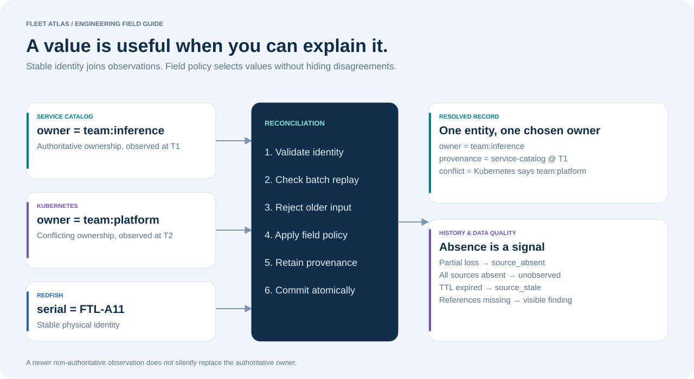
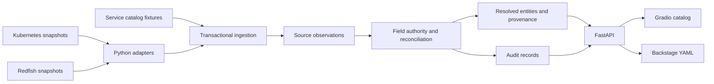

# Architecture

## Data model

`sources` stores authority, heartbeat, and freshness thresholds. `observations` retains source-specific identities, field values, timestamps, and presence. `sync_runs` records import IDs and payload digests. `entities` stores the resolved projection, provenance, and findings. `audit` retains lifecycle changes.

Imports validate identities, timestamps, and field types before reconciliation. A replayed batch is idempotent; reuse of an import ID with different content is rejected. Full snapshots mark omitted source observations absent. Incremental imports leave unmentioned observations alone. Entity history remains after source disappearance.

## Runtime

The API uses one worker and serializes projection rebuilds. SQLite is the local default; Compose uses PostgreSQL. Gradio calls the API over HTTP. The catalog has no experiment manager, telemetry service routes, or Collector dependency. Ports 8002 and 7861 are separate from the telemetry project.

The API optionally requires `CATALOG_API_TOKEN`. This protects API calls, not individual Gradio users. A shared deployment needs authentication on every exposed surface, TLS, and authorization. Schema creation is included; versioned migrations are not yet implemented.
